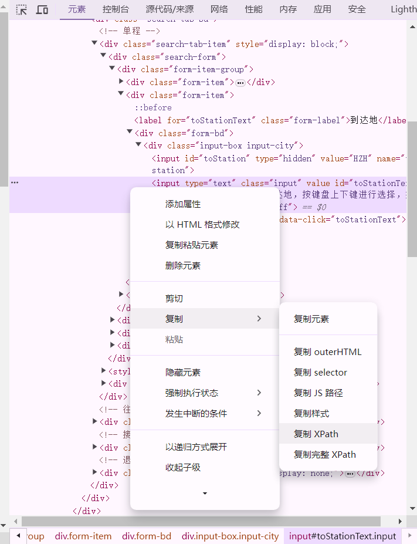

# ChromiumSpider

一个自动管理ChromiumDriver版本的，基于Selenium开发的自动化测试爬虫框架。


<!-- PROJECT SHIELDS -->

[![Contributors][contributors-shield]][contributors-url]
[![Forks][forks-shield]][forks-url]
[![Stargazers][stars-shield]][stars-url]
[![Issues][issues-shield]][issues-url]
[![MIT License][license-shield]][license-url]
[![LinkedIn][linkedin-shield]][linkedin-url]

<!-- PROJECT LOGO -->
<br />

<p align="center">
  <a href="https://github.com/7emotions/ChromiumSpider/">
    
  </a>

  <h3 align="center">Chromium Spider</h3>
  <p align="center">
    自动管理ChromiumDriver版本
    <br />
    <a href="https://github.com/7emotions/ChromiumSpider"><strong>探索本项目的文档 »</strong></a>
    <br />
    <br />
    <a href="https://github.com/7emotions/ChromiumSpider/blob/master/demo.py">查看Demo</a>
    ·
    <a href="https://github.com/7emotions/ChromiumSpider/issues">报告Bug</a>
    ·
    <a href="https://github.com/7emotions/ChromiumSpider/issues">提出新特性</a>
  </p>
</p>


 本篇README.md面向开发者
 
## 目录

- [上手指南](#上手指南)
  - [开发前的配置要求](#开发前的配置要求)
  - [安装步骤](#安装步骤)
- [使用到的框架](#使用到的框架)
- [使用案例](#使用案例)
- [贡献者](#贡献者)
  - [如何参与开源项目](#如何参与开源项目)
- [版本控制](#版本控制)
- [作者](#作者)
- [鸣谢](#鸣谢)

### 上手指南


###### 开发前的配置要求

1. selenium>=4.20.0

###### **安装步骤**

1. 克隆本仓库
```sh
git clone https://github.com/7emotions/ChromiumSpider.git
```


### 使用到的框架

- [Selenium](https://www.selenium.dev/)

### 使用案例

**自动获取12306网站南京开往杭州的高铁信息**

``` python
from io import StringIO

import pandas as pd

from chromiumspider.core import get_spider
from chromiumspider.core import find

if __name__ == '__main__':
    url = r'https://www.12306.cn/index/'
    spider = get_spider() # 默认无头模式，headless=False关闭无头模式

    spider.get(url)

    find(spider, r'//*[@id="fromStationText"]').clear() # 清空输入栏
    find(spider, r'//*[@id="fromStationText"]').send_keys('nanjing') # 模拟键盘输入事件
    find(spider, r'//*[@id="citem_0"]').click() #模拟鼠标点击事件
    find(spider, r'//*[@id="toStationText"]').clear()
    find(spider, r'//*[@id="toStationText"]').send_keys('hangzhou')
    find(spider, r'//*[@id="citem_1"]').click()
    find(spider, r'//*[@id="isHighDan"]').click()
    find(spider, r'//*[@id="search_one"]').click()

    # 切换标签页
    spider.switch_to.window(spider.window_handles[-1])
    
    table = find(spider, r'//*[@id="t-list"]/table')
    html = "<table>" + table.get_attribute('innerHTML') + "</table>"

    df = pd.read_html(StringIO(html), header=0)[0]
    print(df.head())
    df.to_excel('12306.xlsx', index=False) # 结果保存至Excel文件
    spider.quit()

``` 

#### get_spider(headless=True)
该方法返回一个WebDriver

#### find(spider, xpath)
该方法返回一个WebElement，xpath参数可通过Edge开发者模式下，复制元素的xpath来获取


> 有关WebDriver与WebElement的详细说明，请参考[Selenium官方文档](https://www.selenium.dev/documentation/en/webdriver/index/)

### 贡献者
<a href="https://github.com/7emotions/ChromiumSpider/graphs/contributors">
  
</a>

#### 如何参与开源项目

贡献使开源社区成为一个学习、激励和创造的绝佳场所。你所作的任何贡献都是**非常感谢**的。


1. Fork the Project
2. Create your Feature Branch (`git checkout -b feature/AmazingFeature`)
3. Commit your Changes (`git commit -m 'Add some AmazingFeature'`)
4. Push to the Branch (`git push origin feature/AmazingFeature`)
5. Open a Pull Request


### 版本控制

该项目使用Git进行版本管理。您可以在repository参看当前可用版本。

### 作者

**Lorenzo Feng** <br/>
:mailbox: lorenzo.feng@njust.edu.cn

:airplane: Telegram: [Click Me](https://t.me/lorenzofeng)    

 *您也可以在贡献者名单中参看所有参与该项目的开发者。*

### 版权说明

该项目签署了Apache 授权许可，详情请参阅 [LICENSE](https://github.com/7emotions/ChromiumSpider/blob/master/LICENSE.txt)

### 鸣谢

- [Choose an Open Source License](https://choosealicense.com)
- [GitHub Pages](https://pages.github.com)
- [Best README template](https://github.com/shaojintian/Best_README_template/tree/master)

<!-- links -->
[your-project-path]:7emotions/ChromiumSpider
[contributors-shield]: https://img.shields.io/github/contributors/7emotions/ChromiumSpider.svg?style=flat-square
[contributors-url]: https://github.com/7emotions/ChromiumSpider/graphs/contributors
[forks-shield]: https://img.shields.io/github/forks/7emotions/ChromiumSpider.svg?style=flat-square
[forks-url]: https://github.com/7emotions/ChromiumSpider/network/members
[stars-shield]: https://img.shields.io/github/stars/7emotions/ChromiumSpider.svg?style=flat-square
[stars-url]: https://github.com/7emotions/ChromiumSpider/stargazers
[issues-shield]: https://img.shields.io/github/issues/7emotions/ChromiumSpider.svg?style=flat-square
[issues-url]: https://img.shields.io/github/issues/7emotions/ChromiumSpider.svg
[license-shield]: https://img.shields.io/github/license/7emotions/ChromiumSpider.svg?style=flat-square
[license-url]: https://github.com/7emotions/ChromiumSpider/blob/master/LICENSE
[linkedin-shield]: https://img.shields.io/badge/-LinkedIn-black.svg?style=flat-square&logo=linkedin&colorB=555
[linkedin-url]: https://linkedin.com/in/shaojintian


